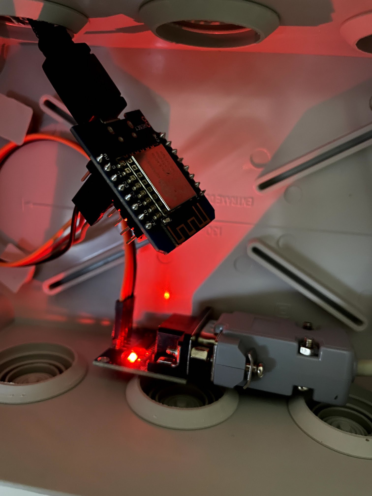
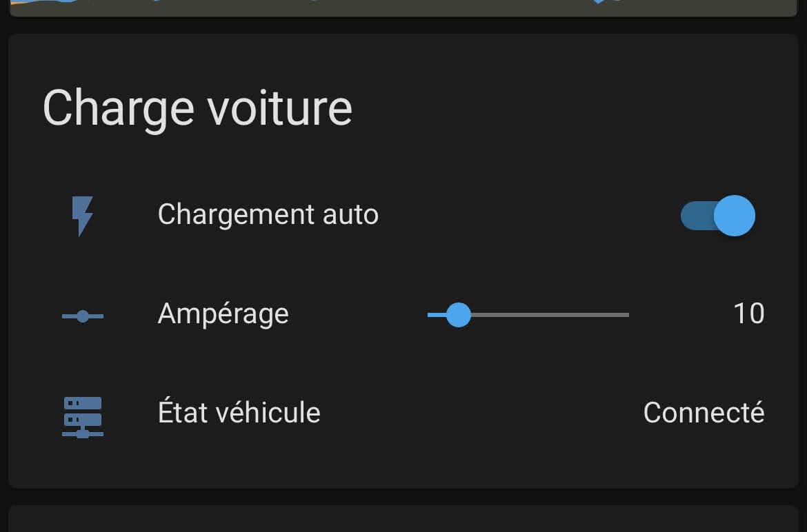

# Ve-Tronic ESPHome

Contrôle à distance de la borne de charge [VE-TRONIC (wb-01)](http://ve-tronic.fr/store/wallbox) avec [EspHome](https://esphome.io/) et un ESP8266 + Max3232.

[Le tout contrôlable depuis Home Assistant.](https://youtu.be/-muLpqeBUFk)




## Materiels

- [Angeek MAX3232](https://www.amazon.fr/gp/product/B07ZDK4BLH)
- [YXPCARS ESP8266 (clone Wemos D1 Mini)](https://www.amazon.fr/gp/product/B08JQKCRL7/)
- Un cable RS-232 mâle-mâle (Prise DB9) **CROISÉ** (⚠️ c'est important… je me suis fait avoir ! Impossible de croiser au niveau des GPIO **ça ne fonctionnera pas**. **Il faut impérativement croiser le cable** Merci Cyril Haenel !).

## Installation physique

### Côté carte

| Wemos |     | MAX3232 |
| :---- | :-: | ------: |
| 3,3v  | ->  |     VCC |
| G     | ->  |     GND |
| D4    | ->  |      RX |
| D3    | ->  |      TX |

## Côté borne

- Connexion en RS-232 sur le connecteur de droite.

## Home Assistant Dashboard énergie

```yaml
utility_meter:
    ve_tronic_consumption_daily:
    name: "VeTronic Consommation (Daily)"
    source: sensor.ve_tronic_power_consumption_kwh
    cycle: daily

sensor:
    - platform: integration
    source: sensor.vetronic_consommation
    name: ve_tronic_power_consumption_kwh
    unit_prefix: k
    unit_time: h
    round: 2
    method: left
```
